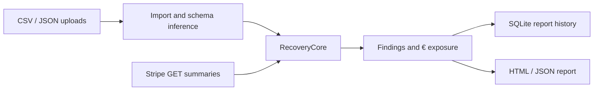

# MeterTruth — live project record

**Updated:** 2026-09-27 (Atlantic/Canary)  
**Candidate:** v0.8 private beta (invoice and credit ledger checks)

**Spend:** €0. Test dependencies were installed only in a temporary environment; no paid services or campaigns used.

**Repository:** `jackieb8877/Metertruth-SaaS`, `main`.

**Deployment:** GitHub reports Vercel deployment checks; the owner confirmed the hosted beta prompted for and accepted the configured credentials.

## Product and positioning

MeterTruth is a read-only, independent revenue-assurance layer above the product event source and a metering/billing system:

`SOURCE USAGE → METERED USAGE → INVOICE → DIFF → € EXPOSURE → REVIEW ACTION → EVIDENCE`

It does not replace Stripe, Lago, Orb or Metronome and does not create bills. Initial flow stays **UPLOAD → RECONCILE → MONEY FOUND**. RecoveryCore remains reusable and independent of vendor adapters.

## Architecture now in code

- `data_import.py`: bounded CSV/JSON/JSONL/NDJSON parsing, wrappers and safe errors.
- `recoverycore_v02.py`: deterministic schema inference, event-level comparison, issue evidence and non-overlapping exposure; supports configured flat and tiered rates.
- `stripe_client.py`, `stripe_bridge.py`, `multi_scan.py`: Stripe API GET-only aggregate connector; key used in request memory only.
- `identity_mapping.py`: one-to-one internal → Stripe customer mapping.
- `scan_history.py`: SQLite report index and report JSON for event-level and Stripe scans; stores names and findings, not original uploads or keys.
- `app.py`: FastAPI UI, onboarding, preflight, demo, reconciliation, Stripe read-only scan, history and report routes.

Local source rows are passed in memory into the core. In history, a report may include customer IDs, event identifiers, quantities and issue evidence; Basic Auth is therefore required for an internet-facing private beta. Vercel/serverless local storage is ephemeral and is not a durable-history offer.

## Current behavior

| Requirement | State |
|---|---|
| CSV upload | Implemented |
| JSON array/object + `data`/`events`/`rows` wrapper | Implemented |
| JSONL / NDJSON | Implemented |
| Schema inference and event-level reconciliation | Implemented |
| Missing, duplicate, wrong quantity, late, orphan | Implemented |
| Customer/metric mismatch and idempotency-collision signals | Implemented |
| Flat and tiered configured prices | Event-level core uses Decimal; Stripe aggregate/portfolio totals use shared Decimal helpers |
| Evidence and recovery recommendation | Implemented as review candidates |
| Stable machine-readable codes for implemented findings | Implemented; legacy `type` values retained for existing consumers |
| Revenue Leak Report | Implemented; reopenable from history |
| Invoice usage line check | Implemented as optional CSV/JSON upload; metered quantities are priced and compared by customer + metric |
| Credit ledger check | Implemented as optional CSV/JSON against invoice credit lines; credit ledger requires invoice input |
| Ledger exposure isolation | Implemented; invoice/credit amounts are separate from source-to-meter exposure to prevent double counting |
| Scan history for CSV/JSON and Stripe scans | Implemented in local SQLite; ephemeral on Vercel/serverless hosting |
| Direct Stripe connector | Existing GET-only, aggregate-level, one meter at a time |
| Pricing drift by price version | Not implemented |
| Credit ledger reconciliation | Not implemented |
| Invoice-total reconciliation | Not implemented |
| Durable multi-tenant hosted persistence/auth | Not implemented |
| Automatic replay/rebill/refund | Intentionally not implemented |

## Verification record

- 67 automated tests pass: `pytest -q` in a temporary venv, including beta, CSV/JSON/JSONL/history, canonical finding-code, decimal quantity, cents, portfolio-rollup, precision-preserving input and invoice/credit mismatch tests.
- Python compile check passes for app, import layer, history, RecoveryCore and connector modules.
- An earlier v0.6 project note recorded 44 passing tests; v0.7 added tests on top of that baseline.

## 2026-09-27 continuation check

- Owner confirmed the deployed Vercel URL prompted for and accepted the configured beta credentials. This verifies the user-visible shared beta gate; it does not verify tenant isolation or persistence.
- The test dependencies installed from `requirements-dev.txt` into a temporary local virtual environment at €0. The full suite passes: 63/63.
- Fresh local synthetic benchmarks: 100,000 adversarial raw events + 100,099 metered rows in 1.475s with 2,198 finding rows; €100 underbilling and €9.90 overbilling. One million clean raw + metered events reconciled in 15.525s with 0 findings and €0 exposure. These are workspace results, not production throughput guarantees.
- RecoveryCore findings include a canonical machine-readable `code` while preserving the existing `type` field for compatibility. `MISSING`, `DUPLICATE` and `ORPHAN_METERED` map to `MISSING_USAGE`, `DUPLICATE_USAGE` and `ORPHAN_METERED_EVENT`.
- Event-level and Stripe aggregate/portfolio reconciliation now use shared Decimal helpers, with half-up cent rounding. Tests cover `0.1 + 0.2`, tier boundaries, positive/negative half cents, and rollups across customers.
- Optional invoice imports compare invoice usage lines with metered quantity × configured prices by customer and metric. Optional credit imports compare positive credit ledger totals with absolute invoice credit-line amounts. These are separate downstream deltas and are not included in the source-to-meter headline exposure. Credits require invoice input. Period grouping, taxes, proration, refunds and provider-specific line semantics are not inferred.
- New adversarial tests confirm a source-to-meter shortfall and invoice/credit deltas remain separately reported without rolling downstream exposure into the core € cards; tiered pricing aggregates split events before applying price tiers, and omitted invoice metrics are rejected when ambiguous. Full suite: 67/67.
- The canonical-code and event-level Decimal source commits had successful Vercel status checks. The Work browser could not independently load the hosted URL in this check; runtime behavior beyond the owner's login test remains unverified.

## Competitive review and attack plan

| Product | What it already solves | MeterTruth response |
|---|---|---|
| Stripe Billing | Meters aggregate usage for billing; summary API is customer/time-window based. Meter event processing is asynchronous. | Reconcile independent source usage against billed aggregates; expose timing window and evidence; do not rebuild billing. |
| Lago | Open-source/cloud billing; events are assigned to periods by event timestamp, including late arrivals. | Cross-system audit and exception report; test period/cutoff assumptions. Open source makes price-only competition weak. |
| Orb | Billing, pricing, usage, credits, invoicing and revenue workflows, with enterprise tiers. | Unbundle just the assurance job and sell a compact, vendor-neutral audit/recovery queue. |
| Metronome | Flexible event ingestion, billable metrics, rating, credits/commits and contract billing. | Audit raw source truth against actual metered outputs and invoice outcomes across vendor boundaries. |

**Product attack:** evidence-linked discrepancy rows, stable imports, customer mapping, period-aware replay candidates, and a vendor-neutral scan history.  
**Price attack:** test a self-serve €49/€99/€199 ladder against sales-led billing implementations; do not infer willingness to pay from list pricing.  
**Unbundling/simplification:** no pricing-engine migration, invoice creation or general ledger; start with two files and one answer.  
**Verticalization:** first test AI/API SaaS with token or request metering, where volume, retries and price changes make discrepancies legible.  
**Recovery differentiation:** eventually attach a proposed replay/adjustment action and independently re-scan the resulting state; never auto-apply a billing mutation in this beta.

Evidence is qualitative at this point. Product documentation proves billing platforms handle ingestion/rating/credits, but does not establish demand for MeterTruth or confirm a stand-alone willingness to pay.

## Commercial hypothesis

- Starter €49/mo, Growth €99/mo, Pro €199/mo: unvalidated hypotheses.
- Target example: 11 Growth customers ≈ €1,089 MRR.
- Even 100 accounts × €4/mo ≈ €400 MRR; low-price expansion alone does not meet the initial €1k goal.
- Validation still needs at least a few real datasets and buyer interviews/design partners. No paid acquisition before evidence.
- LLM-resilient value must come from recurring private datasets, persistent scans/history, connectors and verified recovery outcomes—not a chat explanation.

## Risks / findings

1. Current reports assume EUR with two decimal places; multi-currency and non-two-decimal currencies are not modeled.
2. Invoice and credit checks use a narrow, explicit CSV/JSON schema and do not yet group by billing period; effective-date pricing is also missing.
3. Stripe meter summaries are asynchronous and aggregate-level; a just-arrived usage event may not yet appear. A premature scan can create a false missing signal.
4. Vercel/serverless local storage is ephemeral; current history is only a tester convenience, not persistent SaaS storage. Render Free also has ephemeral storage and sleeps.
5. Basic Auth is one shared beta gate, not tenant isolation or a production identity system; no sensitive customer data should be used in this hosted beta.

## Next backlog, ordered

1. Make invoice and credit mapping user-adjustable; add billing-period grouping, taxes/credits/refunds fixtures and tiered invoice rating.
2. Effective-dated price catalogs and `PRICING_DRIFT`; add pricing-change and billing-boundary fixtures.
3. Connector adapter seam and delayed re-check window for Stripe's asynchronous meter summaries; evaluate Lago export before credentials or OAuth.
4. Durable history, tenant isolation and credential handling only after a design partner validates ongoing monitoring.
5. Pricing validation: ask prospects to quantify existing month-end reconciliation time, missed-usage frequency, invoice disputes, and acceptable recovery fee.

## Decisions

- No new spending without explicit approval.
- No OAuth, automatic invoice changes, refunds, or production data changes in this phase.
- The user connected `jackieb8877/Metertruth-SaaS` and deployed the v0.7 candidate at Vercel. Repository updates continue on `main`; do not incur hosting or service costs without explicit approval.
- v0.8 adds read-only invoice usage and credit checks. No billing mutations are performed; all output remains review evidence.
